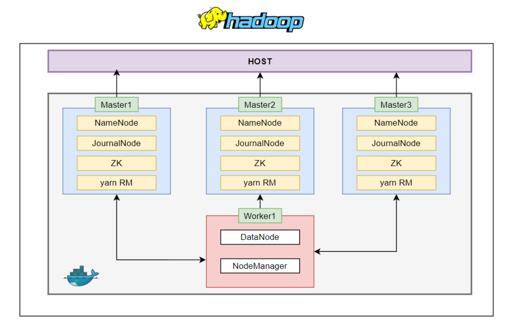

# Hadoop-HA-Cluster-on-Docker
A production-ready, highly available Hadoop cluster (HDFS + YARN) containerized with Docker Compose. Features automatic failover, horizontal scaling



## Cluster Architecture

- **3 Master Nodes** (master1, master2, master3):
  - Namenode (HA)
  - ResourceManager (HA)
  - JournalNode
  - Zookeeper
- **Worker Nodes** (worker1, worker2):
  - Datanode
  - NodeManager


## Project Structure

```
.
├── code/
│── hadoop/
│     ├── core-site.xml
│     ├── hdfs-site.xml
│     ├── mapred-site.xml
│     └── yarn-site.xml
├── scripts/                # Entry scripts for containers
├── zookeeper/              # ZooKeeper configuration (e.g. zoo.cfg)
├── docker-compose.yml      # Multi-node Hadoop HA setup
└── Dockerfile              # Builds hadoop-cluster image
```

## Services Overview

| Service | Role | Ports | Volumes |
|---------|------|-------|---------|
| master1 | Active NN | 9871, 8081 | namenode1, journalnode1 |
| master2 | Standby NN | 9872, 8082 | namenode2, journalnode2 |
| master3 | Standby NN | 9873, 8083 | namenode3, journalnode3 |
| worker1 | DataNode | - | datanode |

## Other Ports

| Component         | Port  | Description              |
|------------------|-------|--------------------------|
| YARN ResourceMgr | 8088  | YARN job monitoring      |
| ZooKeeper        | 2181  | Internal service check   |

## How to Run the Cluster

1. Build the Docker Image
```bash
docker build -t hadoop-cluster:latest .
```

2. Launch the Cluster
```bash
docker-compose up -d
```
Ensure ports 9870, 8088, and others are available.

3. Verify Startup
Check running Java processes:
```bash
docker exec -it master1 jps
```

Check HA status:
```bash
hdfs haadmin -getAllServiceState
yarn rmadmin -getAllServiceState
```

## Failover Testing

### Test HDFS Failover
```bash
hdfs --daemon stop namenode   # Simulate active NN failure
hdfs --daemon start namenode  # Restart later
```

### Test YARN Failover
```bash
yarn --daemon stop resourcemanager
```
Check active/standby transitions using rmadmin.

## Run a Sample MapReduce Job
```bash
hdfs dfs -mkdir /data
echo hi > test.txt
hdfs dfs -put test.txt /data
hdfs dfs -cat /data/*
hadoop distcp /data/* /
hdfs dfsadmin -report
```

## Add a New Worker Node Dynamically
```bash
docker run -d \
  --name worker2 \
  --hostname worker2 \
  --network docker_hadoop_net \
  -e ROLE=worker \
  -v ${PWD}/hadoop:/home/hadoop/config \
  hadoop-cluster:latest
```

## Teardown
```bash
# Graceful shutdown
docker-compose down

# Force remove all containers and volumes
docker-compose down -v
